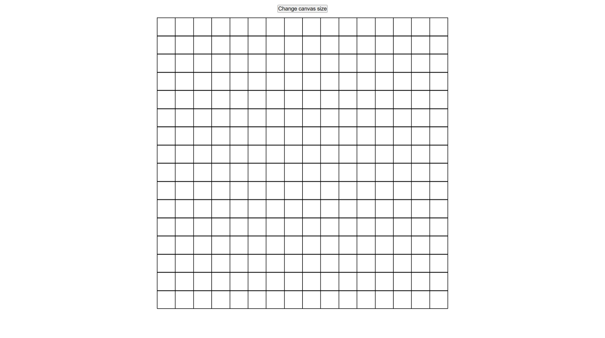
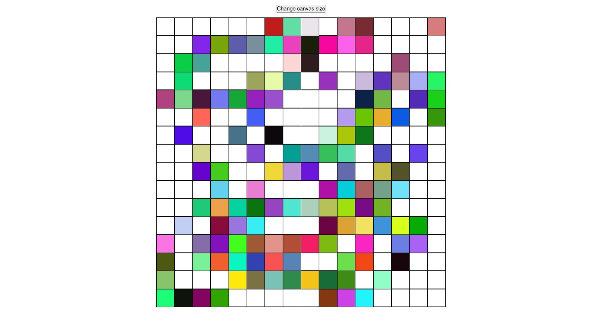
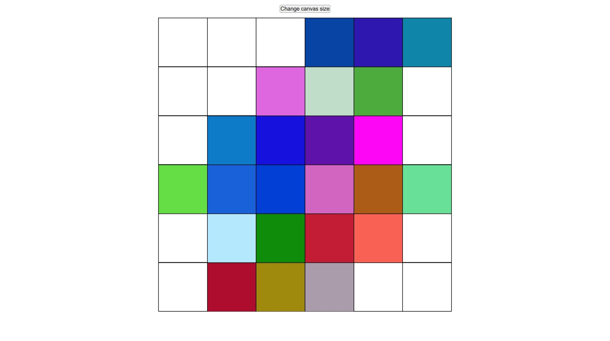
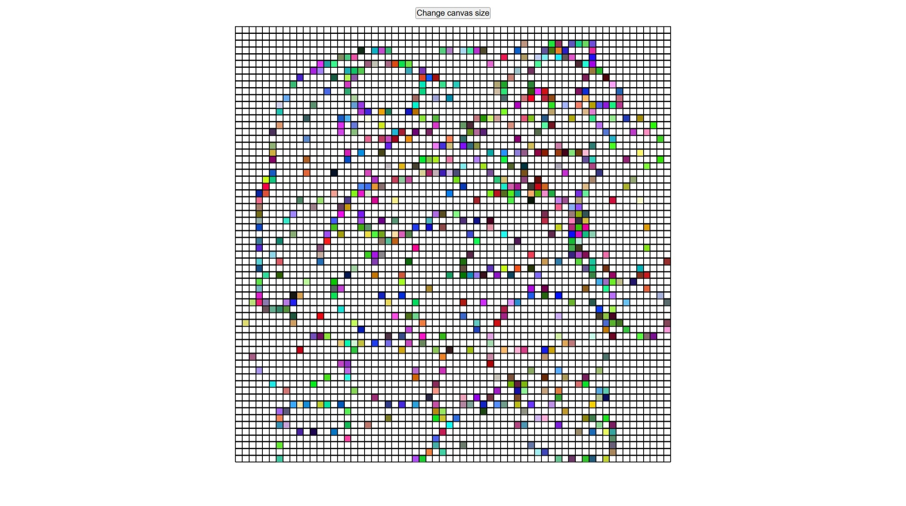

# etch-a-sketch
Etch-a-sketch project based on The Odin Project curriculum.

Live demo link: https://j0e-quan.github.io/etch-a-sketch/

## Technologies used:
 - HTML for basic layout of page
 - CSS for styling grid
 - Flexbox for forming grid and centering elements
 - JavaScript for logic of painting boxes when hovered over and grid resizing
 - Git for version control

## Key features:
 - Boxes of the grid are painted a random colour when hovered over
 - Grid can be resized (from 1 * 1 to 100 * 100)

## Gallery:

